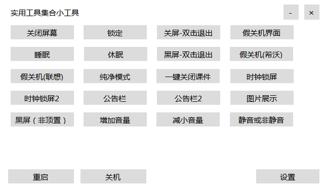
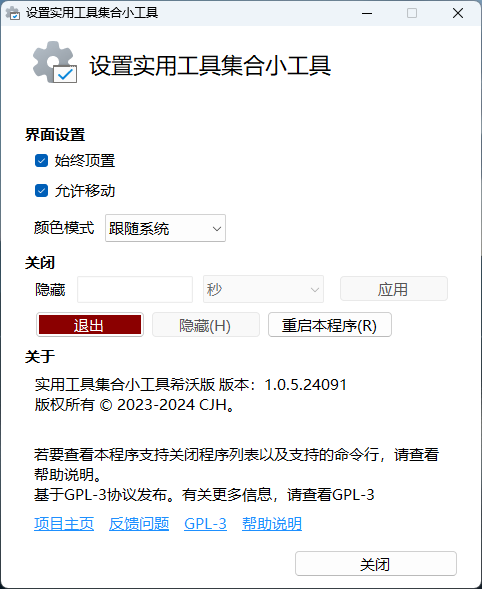

<h1 align="center">
  UsefulControl - 实用工具集合小工具
</h1>

## 关于本项目

这是一个为大屏类电脑（如希沃）编写的实用工具，可以理解为一堆工具的整合包。本软件可以安装在大屏上（例如教学大屏），也可以安装在普通电脑上。

## 功能

本程序支持的功能有：

- [x] 系统操作（睡眠，休眠，锁定，关闭屏幕，调节音量，强制重启，强制关机）
- [x] 小工具系列（时钟锁屏屏保，公告栏，图片展示）
- [x] 模拟界面系列（模拟希沃联想关机界面，模拟系统关机界面，模拟黑屏）
- [x] 支持通过组策略配置策略
- [x] 支持保存你的设置

## 下载

转到[发布页](https://github.com/cjhdevact/UsefulControl/releases/latest)下载程序或源代码。

早期版本的源代码也在发布页里。

## 程序截图

### 工具栏界面

横向：

      

纵向：

      

### 主程序界面

### 设置界面

## 开源说明

在修改和由本仓库代码衍生的代码中需要说明“基于 UsefulControl 开发”。

## 相关项目

[TDocKiller](https://github.com/cjhdevact/TDocKiller) - 一键关闭课件小工具

[LockTime](https://github.com/cjhdevact/LockTime) - 时钟锁屏小工具

[IBoard](https://github.com/cjhdevact/IBoard) - 图片展示小工具

## License

本程序基于`GPL-3.0`协议授权。